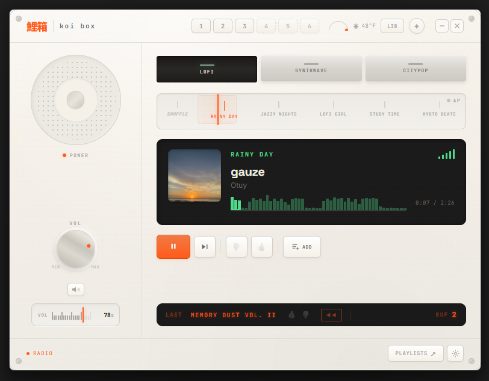

# Koi Box

Koi Box is a desktop radio that generates its own music. Powered by [ACE Step 1.5](https://github.com/ace-step/ACE-Step-1.5), it creates an endless stream of lo-fi, synthwave, and city pop tracks on the fly — no streaming service, no library to curate. Tune to a genre, and it fills your buffer with original songs, complete with (for city pop) lyrics written by a local language model. Choose a genre and settle in to endless tunes, or turn on autopilot mode which reads the time of day and weather to pick the right vibe automatically.

<p align="center">
  
</p>

Koi Box's music categories and genre variants are fully data-driven through YAML config files. You can add a new category (like "Ambient" or "Jazz") by defining it in `config/categories.yaml` with display colors, a generator type, and an optional lyrics engine — then add genre variants under it in `config/genre.yaml` with captions, BPM ranges, key signatures, and duration bounds. New categories and genres can also be created directly from the in-app Settings panel. See [docs/configuration.md](docs/configuration.md) for the full configuration guide.

## 👨‍🎓 Information and Resources

For those with questions, thoughts, and discussion, we encourage you to use our repo's Issue Tracker and Discussions board. Help that's shared publicly there is valuable for the entire user base!

- 🐛 Bugs? Feature Requests?: Visit our [GitHub Issue Tracker](https://github.com/cssquirrel/koi-box/issues)
- 🗨 Usage Questions? General Discussion?: Visit Our [GitHub Discussions](https://github.com/cssquirrel/koi-box/discussions)
- 📖 Documentation?: [Go To Docs](docs/)

## 🏆 Features

- **Radio Mode:** Choose a genre and listen to endlessly generated tunes. Thumbs up the ones you like to save for later! Ace Step 1.5's fast API creates songs faster than real time, so after buffering the first song in a genre, the others are made ahead. Tracks have randomly generated names and artists assigned to them for the sake of the vibe.
- **Autoplay:** Tell Koi Box your location in its settings panel for it to track your local weather and time of day. Hit the Auto Play button in the upper right (looks like a star) and it will automatically shift between different genres to play songs to best fit the moment.
- **Library Setting:** If you have songs generated up and want to not tax the CPU making others, one option is to hit the LIB button to start library mode, where the radio loops back through your pre-generated songs.
- **Player Mode:** Make playlists from favorite songs to keep playing them in a custom playlist your heart desires (also doesn't hit the API when in this mode).
- **Make Your Own Genres:** Using either the settings panel or the YAML files in the config directory, you can add new song categories with their own genres, or tailor existing ones. Look up advice at [Ace Step 1.5's Tutorial](https://github.com/ace-step/ACE-Step-1.5/blob/main/docs/en/Tutorial.md) for guidance on captions and other prompting details.
- **Dark Mode?:** Yes it has a dark mode. It automatically swaps to it after sunset, or you can go to settings and manually update it.

## 💾 Installation Guide

> (Are there issues with this guide? Please let us know by opening an issue!)

### Prerequisites

- **Python 3.10+** (Ace Step 1.5 might require a higher Python version itself.)
- **[ACE-Step 1.5](https://github.com/ace-step/ACE-Step-1.5)** — the AI music generation backend. Koi-Box sends generation requests to its API, which must be running on port 8001 (the default). See the ACE-Step repo for installation and setup.

### Installation

1. Clone or download this repo onto your computer and navigate to the repo's root directory.

2. Create a virtual environment.

```bash
python -m venv venv
```

3. Enter the virtual environment.

```bash
## If Windows
venv\scripts\activate
## If MacOS / Linux
source venv/bin/activate
```

4. Install requirements.

```bash
pip install wheel
pip install -r requirements.txt
```

5. Install `llama-cpp-python`

On Windows, this package often fails to build from source. So we will install it separately with a prebuilt wheel. We only need the CPU version, as the small LLM we use with it is extremely fast for our purposes:

```bash
# CPU only, works quite fast for our purposes.
pip install llama-cpp-python --prefer-binary --extra-index-url https://abetlen.github.io/llama-cpp-python/whl/cpu
```

This package is **optional** — it powers LLM-generated the lyrics for city pop genres. (Or any custom genre you add with lyrics.) Without it, the city pop tracks generate as instrumentals instead. Lo-fi and synthwave genres are unaffected.

## 📻 Running Koi Box

1. Make sure you have the Ace Step 1.5 REST API running.

```bash
uv run acestep-api
```

2. Run the app.

```bash
python src/main.py
```

Enjoy!

### First run

- The database, config, and download directories are created automatically — no manual setup needed.
- If a city pop genre is played, a ~2.4GB Qwen language model downloads on first use for lyrics generation. This is a one-time download but will cause a noticeable delay on that first track.

## Koi Box Uses

- Song generation makes use of the REST API for [Ace Step 1.5](https://github.com/ace-step/ACE-Step-1.5), which is installed and ran separately. Ace Step's model was trained only on public domain and appropriately licensed data.
- Media icons by [vidstack/icons](https://github.com/vidstack/icons) (MIT License, Copyright 2023 Rahim Alwer)
- If using optional dynamics lyrics via LLM, it is powered by [https://huggingface.co/Qwen/Qwen2.5-3B-Instruct](Qwen-2.5-3B-Instruct)
- Album cover images from [Unsplash](https://unsplash.com/).

## 📜 License

This project is licensed under [MIT](https://github.com/cssquirrel/koi-box/blob/main/LICENSE).

Koi Box is meant to be a fun little radio for endless jams thanks to Ace Step 1.5's lovely model. Please follow the guidance [Ace Step](https://github.com/ace-step/ACE-Step-1.5#-license--disclaimer) gives here for responsible use.
